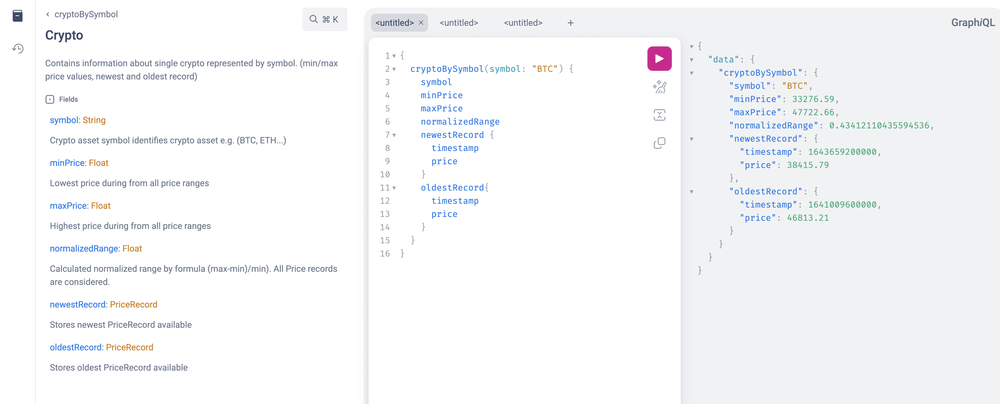

= crypto-recommendation application

Help developers to invest their salaries in crypto by providing information about different crypto assets.
As an input for calculation we use custom CSV files.
Each file represent crypto prices for individual asset.
CSV files are bundled inside the application resource folder.

== How to run the app

----
$ ./gradlew bootRun
----

OR

----
$ ./gradlew bootBuildImage
$ docker run -p 8080:8080 crypto-recommendation:1.0.0
----

To execute tests run

----
 ./gradlew testCoverage
----

== Boot the application

Start your Spring application.
Navigate to http://localhost:8080/graphiql.

== Run the query

Type in the query and click the play button at the top of the window.
Please check a documentation for a graphql api by pressing 'Show documentation explorer' in upper left corner.
There are 3 types of query crypto-recommendation supports.

1) *cryptoBySymbol* - returns the oldest/newest/min/max values for a requested crypto

[source,graphql]
----
{
  cryptoBySymbol(symbol: "BTC") {
    symbol
    minPrice
    maxPrice
    normalizedRange
    newestRecord {
      timestamp
      price
    }
    oldestRecord{
      timestamp
      price
    }
  }
}
----

Curl command:

[source,shell]
----
curl --location 'http://localhost:8080/graphql' \
--header 'Content-Type: application/json' \
--data '{"query":"query cryptoBySymbol($symbol: String) {\n    cryptoBySymbol(symbol: $symbol) {\n        symbol\n        minPrice\n        maxPrice\n        normalizedRange\n        newestRecord {\n            timestamp\n            price\n        }\n        oldestRecord{\n            timestamp\n            price\n        }\n    }\n}","variables":{"symbol":"BTC"}}'
----

2) *getAllSortedByNormalizedRange* - returns descending sorted list of all the cryptos, comparing the normalized range (i.e. (max-min)/min)

[source,graphql]
----
{
  getAllSortedByNormalizedRange{
    symbol
    normalizedRange
  }
}
----

Curl command:

[source,shell]
----
curl --location 'http://localhost:8080/graphql' \
--header 'Content-Type: application/json' \
--data '{"query":"query getAllSortedByNormalizedRange {\n    getAllSortedByNormalizedRange{\n        symbol\n        normalizedRange\n    }\n}","variables":{}}'
----

3) *highestDailyNormalizedRange* -returns the crypto with the highest normalized range for a specific day

[source,graphql]
----
{
  highestDailyNormalizedRange(day: "27.01.2022"){
    day
    symbol
    value
  }
}
----

Curl command:

[source,shell]
----
curl --location 'http://localhost:8080/graphql' \
--header 'Content-Type: application/json' \
--data '{"query":"query  highestDailyNormalizedRange ($day: String) {\n    highestDailyNormalizedRange(day: $day) {\n        day\n        symbol\n        value\n    }\n}","variables":{"day":"27.01.2022"}}'
----

Graphiql Example

== Todo list

- Create alternative parsing service implementation capable of downloading files from remote folder
- add postman/curl examples
- improve service tests
- ratelimiting - https://github.com/MarcGiffing/bucket4j-spring-boot-starter
